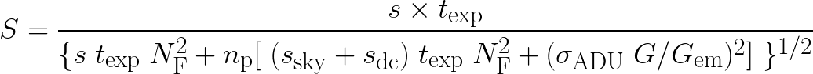

Optimization Method of the EMCCDs of the Acquisition System of the SPARC4 (OMASS4)
----------------------------------------------------------------------------------

The Astrophysics Division of the *Instituto Nacional de Pesquisas Espaciais* (INPE) 
in collaboration with the *Laboratório Nacional de Astrofísica* (LNA) is developing 
a new astronomical instrument, the Simultaneous Polarimeter and Rapid Camera in Four 
Bands [#SPARC4]_. SPARC4 will be installed on the 1.6 m Perkin-Elmer telescope at 
Observatório Pico dos Dias (OPD), Brazil, and it will allow image acquisition in the 
four Sloan Digital Sky Survey (SDSS) photometric bands: g, r, i and z. For the acquisition 
in each band (channel), there is a dedicated iXon Ultra EMCCD, produced by Andor Technology. 
These devices have an optical window and coating optimized for the spectral range in which 
they were designed to operate. These cameras also have frame transfer and electron-multiplying
capabilities, allowing acquisition rates (AR) of up to 26 fps full-frame (1024 x 1024 pixels)
even on faint astronomical objects, which requires high sensitivity for short exposure times.   

The quality of photometric measurements in astronomical observations can be quantified by the signal-to-noise ratio (SNR). Another important constraint concerning many scientific applications expected with SPARC4, especially those requiring fast time-series photometry or polarimetry, is the acquisition rate (AR).  Either the SNR or AR or both can change depending on the configuration of the operational mode of the CCD. Therefore, an optimal selection of the operational mode for each CCD is important to obtain the best performance of the instrument. The CCDs provide a set of parameters to control the operational modes, such as the horizontal and vertical shift speed, the CCD gain, and the electron multiplying on/off mode. In addition, one may consider other parameters to obtain an optimal performance such as the spatial binning, exposure time, and sub-imaging, all of which may or may not have their values restricted by the scientific requirements. These parameters affect the SNR and AR in different ways, with non-linear dependencies, and with additional restrictions. Therefore, an optimal parameters choice for all four CCDs to obtain the highest performance in observations may be a difficult task for a human, even for experienced and skillful observers. 

To solve this problem, we present the Optimization Method of the EMCCDs of the Acquisition System of the SPARC4 (OMASS4) [#OMASS4]_. The OMASS4 uses as figures of merit the signal-to-noise ratio (SNR) and the acquisition rate (AR) as a function of the operation mode of the CCDs. Three different modes of optimization are included in the OMASS4:  (1) optimization of SNR only; (2) optimization of AR only; and (3) optimization of both SNR and AR simultaneously. The first two modes calculate an analytical minimization of the cost function whereas the third mode uses the bayesian optimization method (BOM) to determine the optimum mode of operation. We apply the OMASS4 to find the optimum mode for observations obtained at the Pico dos Dias Observatory, Brazil, and compare the delivered modes of operation and its performance with the ones adopted by the observer. If the OMASS4 had been used as a tool to optimize the CCDs in all of these nights, it would be possible to improve their efficiency in 97.17 %, 65.08 %, and 77.66 % for the optimization modes 1, 2, and 3, respectively. This repo presents the software developed to implement the OMASS4.

Software Description
--------------------

The software to implement the OMASS4 was developed using Python Language 3.7.4 to determine the optimum operation mode of the SPARC4 CCDs. It is structured into three parts: the initialization, the star flux calculation, and the CCD optimization. For the initialization step, it requires to provide to the software all the information related to the astronomical object, i.e.: an image of the object, its (x,y) coordinates, the maximum star radius, a bias image with the respective used CCD operation mode, the SNR, the AR, allowed SI and Bin modes, CCD temperature, and the iterations number of the BOM. Then, the star flux is calculated for the optimal star radius given by the full width at half maximum (FWHM) parameter. The OMASS4 uses a set of packages to calculate the SNR and the AR values according to the CCD operation mode. The code developed to execute the BOM is based on the library provided by [#Koehrsen]_. The used algorithm to model the objective function of the BOM is the tree structured Parzen estimator (TPE). The SNR package operation is based on the methodology presented by [#Bernardes_2020]_. The star flux, sky flux, and the number of star pixels are obtained thorugh a pre-image of the object. The DC noise is calculated according to the model presented by [#Bernardes_2018]_ for the four SPARC4 cameras. The read noise is obtained through the characterization presented in [#Bernardes_2020]_. The G value is obtained through the camera datasheet.

The performance of the EM mode is better than the conventional mode until a max value of 100 photons per pixel. So, the texp of each EM mode is limited to accomplish this requirement. Also, the maximum value allowed for the amplification EM gain :math:`G_{em}` is 300x. Values larger than 300x would deteriorate the device. Furthermore, the :math:`G_{em}` must be such that the CCD will not saturate. For this reason, the maximum EM gain allowed was arbitrarily configured to provide a signal up to 80 % of the pixel well depth. For an image with 16 bits per pixel, this value is :math:`2^{16} \times 0.8 = 52429` analogical to digital unit (ADU). Given that a pixel value is composed by the star, sky and, dark current signals, and the bias level, the maximum value for the :math:`G_{em}` is

.. image:: Images/em_gain.png  
  :align: center
  :width: 200
  

where S, :math:`S_{dc}`, and :math:`S_{sky}` represent the photons number of the star, the mean thermoelectrons, and the mean of the photons number of the sky for the acquired image, respectively;:math:`n_{p}` is the number of pixels considered to calculate the S value, G is the gain of the CCD in e-/ADU, and B is the bias level in ADU. 

The AR package operation is based on the characterization presented of the CCDs presented by [#Bernardes_2020]_. For each mode, the AR value will be calculated through interpolation if :math:`t_{exp}` < :math:`t_{c}`, and it is the inverse of the :math:`t_{exp}`, if :math:`t_{exp}` equals or greater than tc, where :math:`t_{c}` is the time spent by the camera to read one image, as a function of the CCD operation mode.

Therefore, the OMASS4 was implemented using the aforementioned packages, being applied to three different optimization modes: optimize SNR (mode 1), optimize AR (mode 2), and optimize both SNR and AR (mode 3). 

* Mode 1: in this mode, the SNR is optimized, keeping the AR fixed. First, it is selected those modes that accomplish the AR requirement. Then, it is calculated the SNR value for each selected mode, using the maximum values for the :math:`t_{exp}` and :math:`G_{em}`. The optimum mode is given by that one with the highest SNR.
    
* Mode 2: in this mode, the AR is optimized, keeping the SNR fixed. Initially, for each mode, it is calculated the minimum :math:`t_{exp}` value that accomplish the SNR requirement, for the maximum :math:`G_{em}` allowed. For this calculation, it is considered the values of the star flux s = S/:math:`t_{exp}` in photons/s, the sky flux :math:`s_{sky} = S_{sky}/t_{exp}`, in photons/pixel/s, and the dark current :math:`s_{dc} = S_{dc}/t_{exp}`, in e-/pixel/s. So, the equation for the SNR of the star can be written as follows

    
where :math:`\sigma_{ADU}` represents the counts' distribution of the acquired image. :math:`N_{f}` is the noise factor and represents and extra noise added to the image because of the use of the EM amplifier. For an Andor EMCCD, :math:`N_{f}` = 1.41. Rearranging the terms of the equation above and isolating :math:`t_{exp}`,
    

    
The minimum :math:`t_{exp}` of the equation above is given by its smallest non-negative root. Therefore, the optimum mode is given through the calculation of the AR of the selected modes for the minimum :math:`t_{exp}`.
    
* Mode 3: in this mode, both SNR and AR are optimized. Initially, it is selected those modes which accomplish the SNR and AR at the same time. The resulting list of modes is used to create the space of states of the BOM. Then, it is calculated the maximum values :math:`S^{M}` and :math:`A^{M}` and the minimum values :math:`S^{m}` and :math:`A^{m}` of the SNR and AR, respectively. They are used in normalization of both parameters into the range between 0 and 1. So, the function to be optimized is given by the multiplication of the normalized signal to noise ratio :math:`S_{NR}` and acquisition rate A values for each operation mode:

  

Therefore, the optimum mode for the CCD will be given by the set of parameters obtained through the BOM that maximizes the function given by the equation above. Figure below presents the SNR x AR values obtained as a function of the texp, Gem and readout rate of the CCD over the BOM iterations. Through this figure, it is possible to see a maximum point for the readout rate of 1 MHz.

Running the OMASS4
------------------

These instructions will get you a copy of the project up and running on your local machine for development and testing purposes. 

Prerequisites
+++++++++++++

There are some packages that need to be installed before running the software.

* `astropy <https://www.astropy.org/>`__
* `hyperopt <https://github.com/WillKoehrsen/hyperparameter-optimization>`__
* `numpy <https://numpy.org/>`__
* `pandas <https://pandas.pydata.org/>`__
* `matplotlib  <https://matplotlib.org/>`__
* `collections  <https://docs.python.org/3/library/collections.html>`__
* `json <https://www.w3schools.com/python/python_json.asp>`__
* `xlrd  <https://xlrd.readthedocs.io/en/latest/>`__
* `Photutils  <https://photutils.readthedocs.io/en/stable/>`__
* `Scipy <https://www.scipy.org>`__

To install these packages it is suggested to use the pip command as follows::

    pip install <package_name>

Installing
++++++++++

Clone this repo using::

   git clone https://github.com/DBernardes/OMASS4.git
   

Running the tests
+++++++++++++++++

To run a simple test, there is an image created artificially in the example directory. If you run the __main__.py file, the OMASS4 will be executed over this image. You can choose between the options to optimize the SNR, the acquisition rate, or both parameters providing the option 1, 2, or 3 for the optimize function, respectively. Also, you can choose to use or not the pre-image available changing the (y/n) parameter in the observation_setup.txt file. When the execution is done, the optimum mode will be printed on the screen, and a .txt file with the resulting information will be created in the image directory.

Authors and Contact
-------------------

* **Denis Bernardes**: 

email: denis.bernardes099@gmail.com 

License
-------

This project is licensed under the MIT License - see the [LICENSE.md](LICENSE.md) file for details

References
----------

.. [#SPARC4] https://www.spiedigitallibrary.org/conference-proceedings-of-spie/8446/844626/Concept-of-SPARC4--a-simultaneous-polarimeter-and-rapid-camera/10.1117/12.924976.full?casa_token=7b-hbhyqIMoAAAAA%3a99lzc7LW-gGeFuEs1N_7ZGdcFS1EiapC3jbzEYyrWT3PDiUP4RXPDEiR9IdfuRvDY7pPetsPx88&SSO=1

.. [#OMASS4] Bernardes, D. V., Martioli, E., & Spadoti, D. H. (2021). Optimization of EMCCD operating parameters for the acquisition system of SPARC4. Journal of Astronomical Telescopes, Instruments, and Systems, 7(3). https://doi.org/10.1117/1.jatis.7.3.038001

.. [#Koehrsen] https://github.com/WillKoehrsen/hyperparameter-optimization

.. [#Bernardes_2020] Bernardes, D. V. (2020). Otimização dos modos de operação do sistema de aquisição do instrumento SPARC4. Universidade Federal de Itajubá.

.. [#Bernardes_2018] D V Bernardes et al 2018 PASP 130 095002
